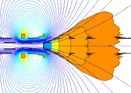

# Magneto-Hidrodinâmica :zap:

Imagem ilustrativa do esquema do funcionamento do propulsor VASIMR
<h3>Dos objetivos deste estudo</h3>
O desenvolvimento dos programas e das bibliotecas tem como objetivo final simular e estudar a propulsão plasmática e sobretudo a Magneto-Hidrodinâmica.

<h3>Recomendações</h3>
 :arrow_right:Implementar fontes com <i>Programming Ligatures</i> no IDE:
 :arrow_right:Essas fontes facilitam e embelezam a visualização do código e as ajudas, Exemplos:
 .   :arrow_right_hook:<a href="https://github.com/tonsky/FiraCode"><b>Fira Code (RECOMENDADO)</b></a>
 .  :arrow_right_hook:<a href="https://github.com/i-tu/Hasklig">Haskling</a>
 .    :arrow_right_hook:<a href="https://github.com/be5invis/Iosevka/releases">Iosevka</a>
 .   :arrow_right_hook:<a href="https://github.com/ToxicFrog/Ligaturizer">Ligaturizer</a>
 
 :arrow_right:Fazer uso do Spyder como ambiente de desenvolvimento integrado (IDE):
 .   :arrow_right_hook:Instalar o Spyder pelo <a href="https://www.anaconda.com/">Anaconda</a>
