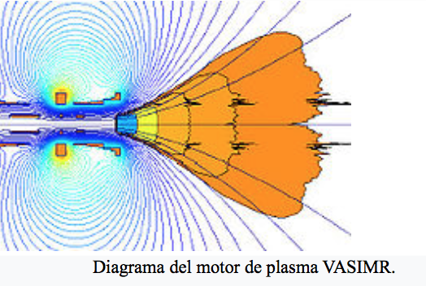

# Magneto-Hidrodinâmica

##Dos objetivos deste estudo

O desenvolvimento dos programas e das bibliotecas tem como objetivo final simular e estudar a propulsão plasmática e sobretudo a Magneto-Hidrodinâmica

